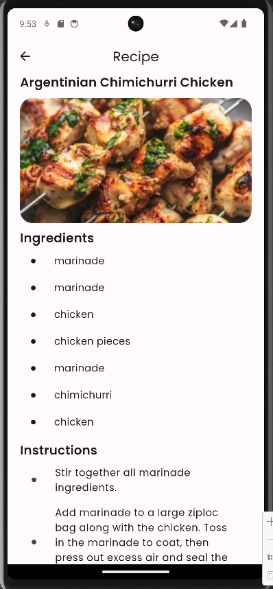

# The Chef

The Chef is a flutter based recipe app.

# Features

- Explore a vast library of recipes spanning cuisines from around the world.
- Navigate through recipes effortlessly with an intuitive Swiper interface.
- Find the perfect dish with ease using our powerful search functionality.

# Tech Used

Flutter, Dart, Spoonacular Recipe Api

# Screen Shots

<table>
   <tr>
    <td align="center">SignUp Screen</td>
    <td align="center">Login Screen</td>
    <td align="center">Home Screen</td>
    <td align="center">Recipe Search</td>
    <td align="center">Recipe Info</td>
     
  </tr>
  <tr>
    <td align="center"></td>
    <td align="center"></td>
    <td align="center"></td>
    <td align="center"></td>
    <td align="center"></td>
  </tr>
</table>

# Note

Create your own api key from www.spoonacular.com
